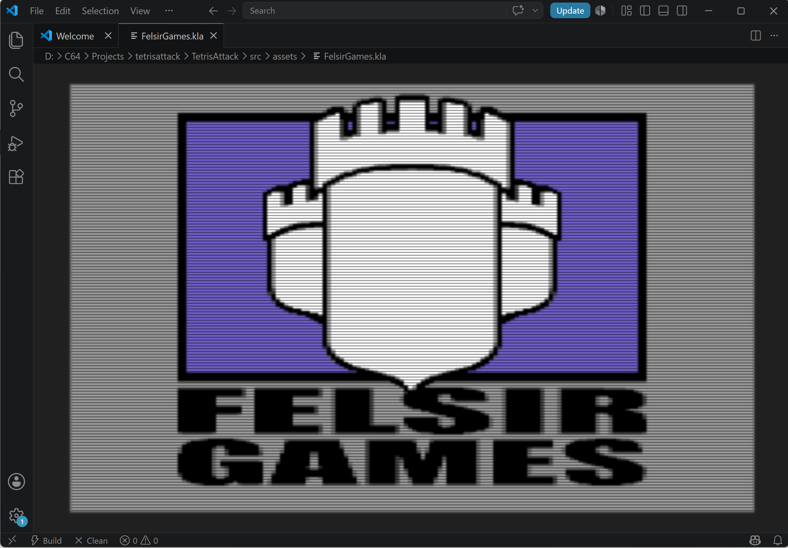

# Koala Viewer

A Visual Studio Code extension for viewing Commodore 64 KoalaPainter images (`.kla` and `.koa`).

## Features

- View `.kla` and `.koa` files directly inside VS Code
- Accurate Commodore 64 multicolor bitmap rendering
- Authentic C64 color palette
- CRT scanline effect
- Pixel-perfect scaling
- Read-only viewer

## Supported Formats

| Format | Supported |
|----------|----------|
| .kla | ✔ |
| .koa | ✔ |

## Usage

Open any `.kla` or `.koa` file.

If VS Code asks how to open the file:

1. Right click the file
2. Select **Open With...**
3. Choose **Koala Viewer**
4. Optionally select **Set as Default**

## Requirements

No additional software is required.

## Known Limitations

- Read-only
- No image editing

## About KoalaPainter

KoalaPainter was one of the most popular graphics programs for the Commodore 64.

A Koala image consists of:

- 8000 bytes bitmap data
- 1000 bytes screen RAM
- 1000 bytes color RAM
- 1 byte background color

Rendered as a 320×200 multicolor bitmap.

## License

MIT